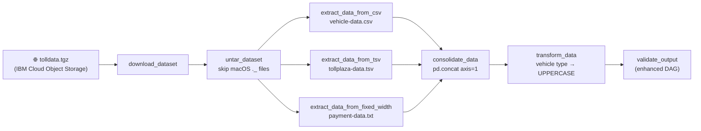
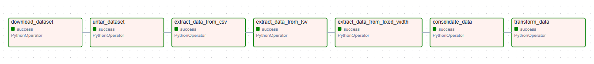
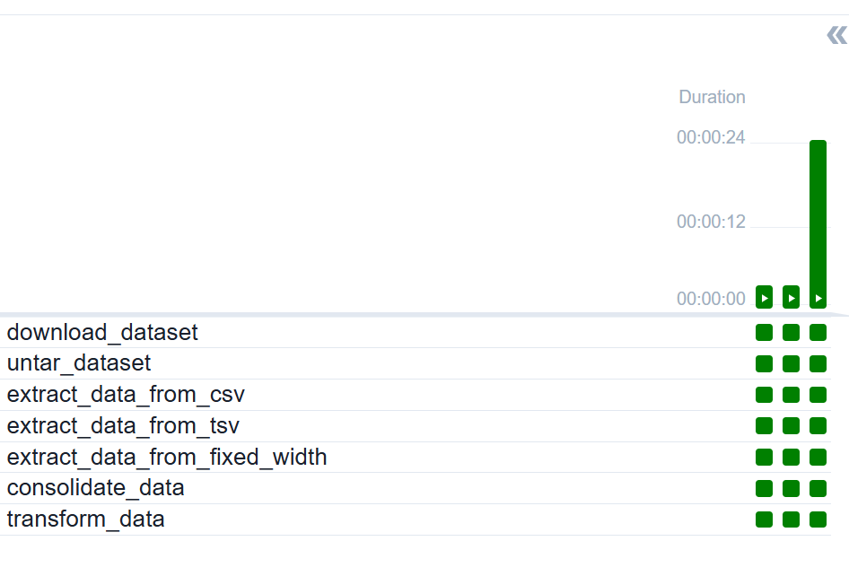
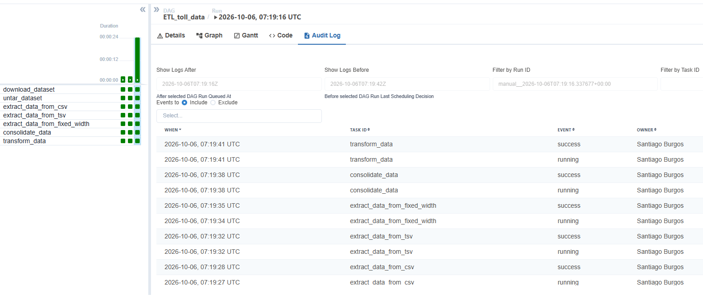
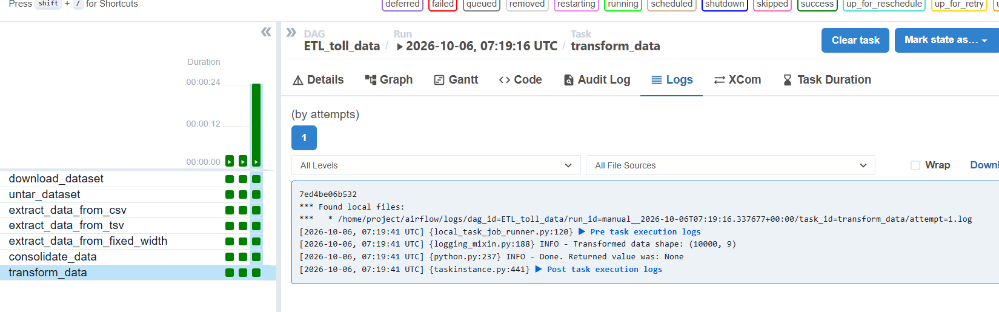

# 🚦 Toll Data ETL Pipeline — Apache Airflow PythonOperator + pandas


An **Apache Airflow ETL pipeline** written entirely with **`PythonOperator`** and **pandas**.
It downloads toll plaza traffic data, extracts fields from **three different file formats**
(CSV, TSV with Windows line endings, and fixed width), consolidates them into a single
dataset and transforms it for analysis.

> Final project of the IBM course **"ETL and Data Pipelines with Shell, Airflow and Kafka"**
> (IBM Data Engineering Professional Certificate).
> Part of a three-project series on the same toll data:
> [Bash + BashOperator](https://github.com/SaBuMa/toll-data-etl-airflow) ·
> **Python + PythonOperator** (this repo) ·
> [Kafka streaming](https://github.com/SaBuMa/toll-traffic-streaming-kafka)

---

## 📋 Table of Contents
- [Project Scenario](#-project-scenario)
- [Architecture](#-architecture)
- [Tech Stack](#-tech-stack)
- [Repository Structure](#-repository-structure)
- [Two DAG Versions](#-two-dag-versions)
- [Pipeline Steps](#-pipeline-steps)
- [Airflow in Action](#-airflow-in-action)
- [How to Run](#-how-to-run)
- [Testing](#-testing)
- [What I Learned](#-what-i-learned)
- [Future Improvements](#-future-improvements)
- [Author](#-author)

---

## 🎯 Project Scenario

As a data engineer at a data analytics consulting company, I was assigned to a project that aims to
**de-congest national highways** by analyzing road traffic data from different toll plazas.
Each highway is operated by a different toll operator with a **different IT setup and file format**.
The job: collect the data available in those formats and consolidate it into a single file.

---

## 🏗️ Architecture



| Stage | Input | Output |
|---|---|---|
| **Extract** | 3 files, 3 formats | `csv_data.csv` (4 cols), `tsv_data.csv` (3 cols), `fixed_width_data.csv` (2 cols) |
| **Consolidate** | the three extracts | `extracted_data.csv` (9 cols) |
| **Transform** | `extracted_data.csv` | `transformed_data.csv`: `car` → `CAR` |

```
 1,Thu Aug 19 21:54:38 2021,125094,CAR,2,4856,PC7C042B7,PTE,VC965
 └──────────── CSV ────────────────┘ └──── TSV ────┘ └ fixed ┘
```

---

## 🧰 Tech Stack

| Tool | Role |
|---|---|
| **Apache Airflow 2.x** | Orchestration: scheduling, retries, dependencies, logs |
| **`PythonOperator`** | Runs each Python function as a task |
| **pandas** | `read_csv`, `read_fwf`, `concat`, `.str.upper()` |
| **requests** | Download with timeout and HTTP error handling |
| **tarfile** | Safe archive extraction (`filter="data"`) |
| **unittest** | 11 end-to-end tests with mocked network and stubbed Airflow |

---

## 📁 Repository Structure

```
toll-data-etl-python-operator/
├── dags/
│   ├── submission/
│   │   └── ETL_toll_data.py            # Course version: sequential, run in Airflow ✅
│   └── enhanced/
│       └── ETL_toll_data_enhanced.py   # Portfolio version: parallel + validation
├── tests/
│   └── test_pipeline.py                # 11 tests, no Airflow or internet needed
├── docs/
│   ├── python-operator-guide.md        # Kitchen analogy + key concepts with diagrams
│   ├── data-sources.md                 # Formats, fields, output schema
│   └── troubleshooting.md              # Real bugs found while building, and their fixes
├── screenshots/
├── requirements.txt
├── LICENSE
└── README.md
```

---

## 🔀 Two DAG Versions

| | `ETL_toll_data.py` | `ETL_toll_data_enhanced.py` |
|---|---|---|
| Purpose | Course submission | Portfolio showcase |
| Extraction | Sequential | **Parallel** (fan-out / fan-in) |
| Validation | — | **`validate_output` task**: shape, missing values, uppercase check |
| Row-count guard | — | **Fails** if the extracts have different lengths |
| Staging folder | Hardcoded | `TOLL_STAGING` environment variable |
| Airflow imports | Airflow 2 | **Airflow 2 and 3** (`try/except`) |
| DAG style | `dag=dag` on each task | `with DAG(...)` context manager, `catchup=False`, tags |
| Run in Airflow | ✅ | Tested with unit tests (not yet run in Airflow) |

```
 Submission:  download → untar → csv → tsv → fixed → consolidate → transform

 Enhanced:                      ┌→ csv   ─┐
              download → untar ─┼→ tsv   ─┼→ consolidate → transform → validate
                                └→ fixed ─┘
```

---

## ⚙️ Pipeline Steps

| Task | What it does | Key detail |
|---|---|---|
| `download_dataset` | Downloads `tolldata.tgz` | `timeout=30` + `raise_for_status()`: a failed or hung download turns the task 🔴 and triggers a retry |
| `untar_dataset` | Extracts the archive | Skips macOS `._` metadata files; `filter="data"` blocks unsafe paths |
| `extract_data_from_csv` | 4 fields from `vehicle-data.csv` | `header=None`, 0-based `usecols=[0,1,2,3]` |
| `extract_data_from_tsv` | 3 fields from `tollplaza-data.tsv` | pandas normalizes the source's `\r\n` endings, verified with `cat -A` |
| `extract_data_from_fixed_width` | 2 fields from `payment-data.txt` | Read **by position**: `colspecs=[(58,61),(62,67)]` |
| `consolidate_data` | Joins the 3 extracts side by side | `pd.concat(axis=1)` → 10000 × 9 |
| `transform_data` | Uppercases the vehicle type | `df[3] = df[3].str.upper()` |

Field positions, formats and the output schema: [docs/data-sources.md](docs/data-sources.md).

---

## 🖥️ Airflow in Action

**Graph view:** seven `PythonOperator` tasks, all successful



**Run history:** three successful runs, every task green



**Audit log:** each task starts only after the previous one succeeds, owner set in `default_args`



**Task log:** `transform_data` reports the final dataset shape, `(10000, 9)`



*`Returned value was: None` is expected: the functions write files instead of returning data,
which keeps large datasets out of Airflow's metadata database (XCom).*

---

## 🚀 How to Run

> Tested in the IBM Skills Network Cloud IDE (Airflow 2.x).

**1. Create the staging folder**
```bash
sudo mkdir -p /home/project/airflow/dags/python_etl/staging
sudo chmod -R 777 /home/project/airflow/dags/python_etl
```

**2. Deploy the DAG**
```bash
cp dags/submission/ETL_toll_data.py /home/project/airflow/dags/
# or the enhanced version:
cp dags/enhanced/ETL_toll_data_enhanced.py /home/project/airflow/dags/
```

**3. Check it loads and run it once**
```bash
airflow dags list-import-errors        # should print: No data found
airflow dags test ETL_toll_data        # runs every task once, no scheduler needed
```

**4. Verify the result**
```bash
wc -l /home/project/airflow/dags/python_etl/staging/transformed_data.csv    # 10000
head -3 /home/project/airflow/dags/python_etl/staging/transformed_data.csv
```

---

## 🧪 Testing

```bash
pip install -r requirements.txt
python3 -m unittest discover -s tests -v
# Ran 11 tests ... OK
```

The tests run the whole enhanced pipeline on a sample archive built in the **real formats**
(CSV without trailing newline, TSV with `\r\n`, 67-character fixed-width lines, macOS `._` files).
`requests.get` is mocked and Airflow is stubbed, so no internet or Airflow install is needed.

| Covered | |
|---|---|
| `._` files skipped during extraction | ✅ |
| Correct columns from each source | ✅ |
| No `\r` left from the TSV | ✅ |
| Fixed-width positions stay right when padding changes | ✅ |
| No index or header in the output | ✅ |
| Final file: 9 columns, uppercase vehicle types | ✅ |
| Validation passes on good data and **fails** on bad data | ✅ |
| Consolidation **refuses** extracts of different lengths | ✅ |
| HTTP errors fail the download task | ✅ |
| DAG wiring: fan-out after untar, fan-in at consolidate | ✅ |

---

## 💡 What I Learned

- **`python_callable=func`, not `func()`**: Airflow needs the function itself (the "recipe card"), so it can call it when the task runs
- **Tasks fail by raising, not by printing**: `raise_for_status()` and timeouts make failures visible to Airflow, so retries work
- **Absolute paths only**: each task runs in a temporary directory, so relative paths lose files
- **0-based vs 1-based**: `cut -c 59-61` in bash is `colspecs=(58, 61)` in pandas
- **Fixed-width files are read by position**, not by splitting on spaces: padding changes with the data
- **`to_csv` writes an index and header by default**: both had to be turned off for the files to join cleanly
- **`pd.concat(axis=1)` aligns by index labels**, not by line number like `paste`
- **Verify with evidence**: `cat -A` on input *and* output, `head`, `wc -l`, and checking the file is fresh before debugging code
- **Safe extraction** with `tarfile`'s `filter="data"`, and why archives from the internet need it

The full story behind each of these, with diagrams: [docs/python-operator-guide.md](docs/python-operator-guide.md) and [docs/troubleshooting.md](docs/troubleshooting.md).

---

## 🔭 Future Improvements

- [ ] Run the enhanced DAG in Airflow and add its Graph view (parallel branches)
- [ ] Pass file paths between tasks with XCom instead of shared constants
- [ ] Load `transformed_data.csv` into PostgreSQL with a `PostgresOperator` / hook
- [ ] Rewrite with the **TaskFlow API** (`@task` decorators) to compare styles
- [ ] Write Parquet instead of CSV for typed, compressed storage
- [ ] Docker Compose setup for running Airflow locally
- [ ] GitHub Actions workflow to run the tests on every push

---

## 👤 Author

**Santiago Burgos** — Electronics Engineer transitioning into Data Engineering

[](https://github.com/SaBuMa)
[](https://www.linkedin.com/in/santiagoburgosm)

---

<sub>Project scenario and dataset provided by IBM Skills Network as part of the IBM Data Engineering
Professional Certificate. DAGs, tests and documentation by Santiago Burgos.</sub>
